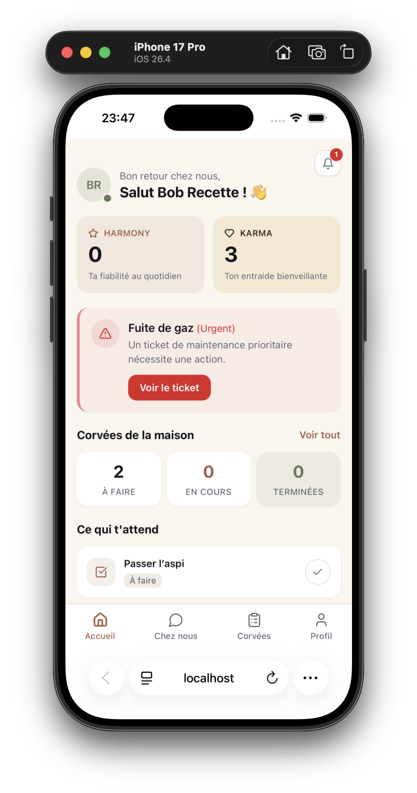
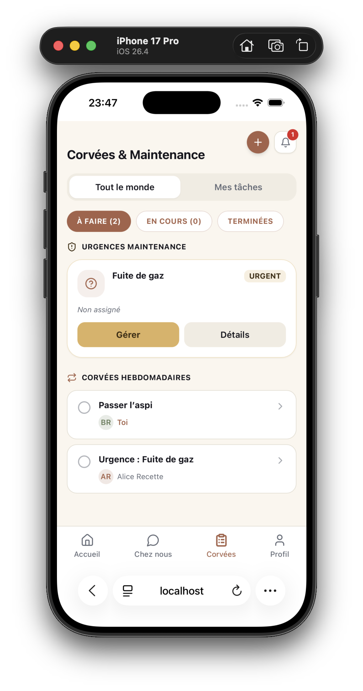
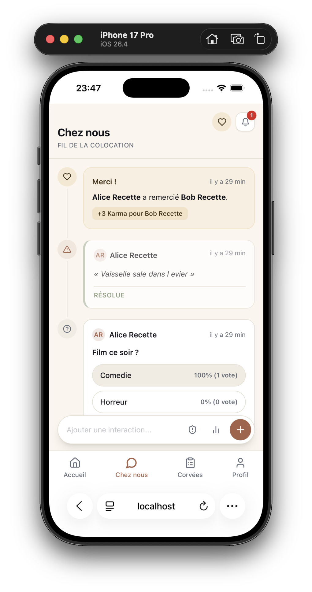
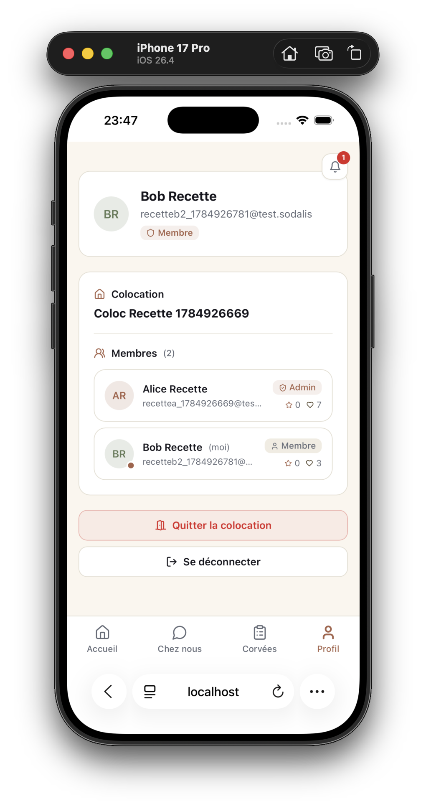

# Manuel d'utilisation — Sodalis

## Résumé pour le dossier de certification

Ce manuel s'adresse à un colocataire, pas à un développeur : aucun terme technique n'y est employé sans explication. Il couvre la prise en main complète de l'application (créer un compte, créer ou rejoindre une colocation), les quatre écrans principaux (Accueil, Corvées, Chez nous, Profil), les notifications, la distinction entre les deux rôles (Administrateur/Membre), et l'utilisation au clavier seul. Il sert aussi de preuve qu'un utilisateur n'ayant jamais vu l'application peut s'en servir seul.

---

## 1. Premiers pas

### Créer un compte

Sur l'écran d'accueil, l'onglet **« S'inscrire »** est en haut du formulaire (à côté de « Se connecter »). Renseignez votre prénom et nom, votre adresse e-mail, et un mot de passe d'au moins 8 caractères (à saisir deux fois pour confirmation). Validez avec **« Créer mon compte »**.

### Créer ou rejoindre une colocation

Juste après l'inscription (ou la première connexion si vous n'avez pas encore de colocation), l'application vous amène automatiquement à une étape « Votre colocation », avec deux options :

- **« Créer une coloc »** : donnez un nom à votre colocation (ex. « Appart Lyon Centre ») et validez avec **« Créer ma colocation »**. Un **code d'invitation** apparaît alors à l'écran (ex. `appart-lyon-3f9a`) — copiez-le avec le bouton **« Copier »** et partagez-le avec vos colocataires. Une fois prêt, appuyez sur **« Continuer »** pour accéder à l'application.
- **« Rejoindre »** : saisissez le code d'invitation transmis par un colocataire, puis validez avec **« Rejoindre la colocation »**.

Vous n'avez besoin de faire cette étape qu'une seule fois : elle ne réapparaît pas aux connexions suivantes.

---

## 2. Se déplacer dans l'application

Une barre de navigation reste fixée en bas de l'écran, avec quatre entrées :

| Icône | Nom | Contenu |
|---|---|---|
| Maison | **Accueil** | Le tableau de bord |
| Bulle de discussion | **Chez nous** | Plaintes, sondages, remerciements |
| Presse-papier | **Corvées** | Tickets de maintenance et tâches ménagères |
| Silhouette | **Profil** | Vos informations, votre colocation, vos colocataires |

Une cloche de notification est visible en permanence en haut à droite de l'écran (voir section 6).

---

## 3. Accueil (tableau de bord)

Le tableau de bord affiche, dans l'ordre :

- Votre nom et un résumé de vos deux scores : le **score d'harmonie** (fiabilité — augmente quand vous terminez vos tâches ménagères, davantage si c'est dans les délais) et le **score de karma** (vie sociale — augmente quand on vous remercie, quand vous votez à un sondage, ou quand vous résolvez une plainte).
- Une bannière d'alerte si un ticket de maintenance **urgent** est en cours dans la colocation.
- Un résumé du nombre de corvées par état, et du nombre de plaintes encore ouvertes.
- Vos prochaines tâches à faire, avec la possibilité de les marquer terminées directement depuis cet écran.
- Un classement des colocataires (activité récente).
- Le fil des dernières notifications de la colocation.

Si le chargement échoue, un bouton **« Réessayer »** est proposé.

---

## 4. Corvées (maintenance et tâches ménagères)

### Signaler et suivre un problème de maintenance

Appuyez sur le bouton **« + »** en haut à droite (bulle ronde). Une fenêtre s'ouvre pour créer soit un ticket de maintenance (ex. plomberie, électricité, panne d'appareil), soit une tâche ménagère classique. Pour un ticket de maintenance, précisez un titre, une catégorie, et un niveau de priorité — un ticket marqué **« Urgent »** apparaît épinglé en haut de la page, dans la section « Urgences maintenance », et déclenche automatiquement la création d'une tâche de suivi pour que quelqu'un s'en occupe sans délai.

Deux onglets permettent de filtrer l'affichage : **« Tout le monde »** ou **« Mes tâches »**. Trois filtres complémentaires permettent de voir les éléments à faire, en cours, ou terminés, avec le nombre affiché sur chaque filtre.

### Créer, assigner et suivre une tâche ménagère

Depuis la même fenêtre « + », choisissez l'onglet tâche ménagère : titre, colocataire assigné, et éventuellement une date limite. Une tâche affichée dans la liste peut être ouverte (appui sur la ligne) pour voir son détail, changer son statut, ou — si vous êtes Administrateur — l'assigner à quelqu'un d'autre.

---

## 5. Chez nous (vie sociale)

Cet écran rassemble trois usages, accessibles depuis la barre d'actions en bas de l'écran :

- **Plaintes** : signaler un désagrément (au besoin de façon anonyme), consulter les plaintes en cours, les marquer résolues ou les supprimer (réservé à l'auteur ou à un Administrateur).
- **Sondages** : proposer un sondage avec au moins deux options, voter, consulter les résultats en direct. Un sondage peut être fermé par son créateur ou un Administrateur — plus personne ne peut alors y voter.
- **Karma** : remercier un colocataire pour un service rendu (bouton dédié en haut de l'écran) — chaque remerciement augmente son score de karma. Vous ne pouvez pas vous remercier vous-même, et un délai de 24h s'applique entre deux remerciements envoyés à la même personne.

---

## 6. Notifications

La cloche visible en permanence en haut à droite affiche un badge avec le nombre de notifications non lues. Un appui l'ouvre : vous y retrouvez les événements récents de votre colocation (nouveau ticket, tâche assignée, plainte, sondage, remerciement…), qui apparaissent **en temps réel**, sans avoir besoin de recharger la page, dès qu'un autre colocataire déclenche un événement. Ouvrir le panneau marque les notifications comme lues.

---

## 7. Profil, colocation et rôles

L'écran Profil regroupe :

- Vos informations (nom, e-mail, rôle).
- Les informations de votre colocation, avec le code d'invitation si vous êtes Administrateur (copiable, et régénérable si besoin — l'ancien code cesse alors de fonctionner).
- La liste des membres de la colocation.
- Un bouton pour quitter la colocation, et un bouton pour vous déconnecter.

### Ce que change le rôle

| Action | Membre | Administrateur |
|---|---|---|
| Consulter la colocation, créer des corvées/tickets/plaintes/sondages | Oui | Oui |
| Voir et copier le code d'invitation | Non | Oui |
| Régénérer le code d'invitation | Non | Oui |
| Assigner un ticket de maintenance à quelqu'un | Non | Oui |
| Expulser un membre / transférer le rôle d'Administrateur | Non | Oui |

Le créateur d'une colocation en devient automatiquement Administrateur. Si l'Administrateur quitte la colocation, le rôle est automatiquement transmis au membre le plus ancien.

---

## 8. Accessibilité — navigation au clavier

L'application peut être utilisée entièrement au clavier, sans souris :

- Un **lien d'évitement** (« Aller au contenu principal »), invisible tant qu'il n'a pas le focus, apparaît dès la première touche **Tab** et permet de sauter directement au contenu de la page sans repasser par la barre de navigation à chaque écran.
- Dans toute fenêtre modale (ex. création de ticket, fenêtre de remerciement), la touche **Tab** reste piégée à l'intérieur de la fenêtre tant qu'elle est ouverte — impossible de « sortir » accidentellement de la modale par erreur de focus.
- La touche **Échap** ferme n'importe quelle fenêtre modale ouverte et redonne le focus au bouton qui l'avait ouverte.

---

## 9. Justification technologique (renvoi)

Ce manuel décrit l'usage de l'application ; les choix techniques qui le rendent possible (pourquoi une architecture en microservices, pourquoi les notifications sont transmises en temps réel via WebSocket, pourquoi les données sont réparties sur plusieurs bases) sont détaillés et justifiés dans `sodalis-backend/ARCHITECTURE.md`, section 9 (« Choix stratégiques »).
